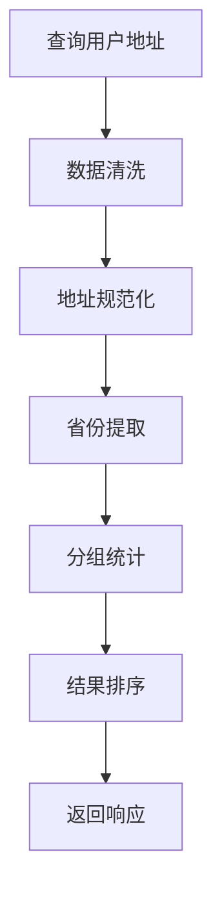

# 用户地址分布统计功能说明

## 功能概述

新增用户地址分布统计接口，用于获取全国各地用户分布情况。该功能基于微信消息地址分析数据，提供省份/地区级别的用户分布统计。

## 核心特性

### 1. 地址规范化处理
- **前缀提取**: 默认取地址字符串前两个字符作为省份标识
- **特殊省份处理**:
  - 内蒙古：识别"内蒙"开头的地址为"内蒙古"
  - 黑龙江：识别"黑龙"开头的地址为"黑龙江"
- **数据清洗**: 过滤无效地址（未识别、提取失败、空值等）

### 2. 数据统计逻辑
- **用户去重**: 每个用户只统计一次，取最新的地址记录
- **地区排除**: 自动排除包含"北京大兴"的地址记录
- **计数统计**: 按省份/地区分组统计用户数量
- **结果排序**: 按用户数量降序排列

### 3. 数据源
- **数据表**: `wechat_message_a_analyze_address`
- **SQL查询**: 
```sql
SELECT MAX(address) AS address
FROM wechat_message_a_analyze_address
WHERE address NOT LIKE '%北京%大兴%'
  AND address IS NOT NULL
  AND address != ''
  AND address != '未识别'
  AND address != '提取失败'
GROUP BY wechat_id;
```

## 接口详情

### API端点
```
GET /analyze/address/distribution
```

### 响应格式
```json
{
    "success": true,
    "message": "用户地址分布查询成功",
    "data": [
        {
            "province": "北京",
            "count": 128
        },
        {
            "province": "上海", 
            "count": 95
        }
    ],
    "totalUsers": 348,
    "provinceCount": 5,
    "queryTime": "2024-01-15 14:30:00"
}
```

### 响应字段说明
- `data`: 省份分布数组，按用户数量降序排列
  - `province`: 省份/地区名称
  - `count`: 该省份的用户数量
- `totalUsers`: 总用户数（有效地址的用户）
- `provinceCount`: 涉及的省份/地区数量
- `queryTime`: 查询时间

## 实现细节

### 1. 数据处理流程


### 2. 关键代码模块

#### 地址分布计算
```java
private Map<String, Integer> calculateAddressDistribution(List<String> userAddresses) {
    Map<String, Integer> distribution = new HashMap<>();
    
    for (String address : userAddresses) {
        // 数据清洗
        if (address == null || address.trim().isEmpty() || 
            "未识别".equals(address) || "提取失败".equals(address)) {
            continue;
        }
        
        // 省份提取
        String province = extractProvinceKey(address.trim());
        if (province != null && !province.isEmpty()) {
            distribution.put(province, distribution.getOrDefault(province, 0) + 1);
        }
    }
    
    return distribution;
}
```

#### 省份关键字提取
```java
private String extractProvinceKey(String address) {
    if (address == null || address.length() < 2) {
        return null;
    }
    
    // 特殊处理：内蒙古
    if (address.startsWith("内蒙")) {
        return "内蒙古";
    }
    
    // 特殊处理：黑龙江
    if (address.startsWith("黑龙")) {
        return "黑龙江";
    }
    
    // 默认取前两个字符
    return address.substring(0, 2);
}
```

## 使用场景

### 1. 用户分布分析
- 了解用户的地理分布情况
- 制定地域化运营策略
- 评估市场渗透率

### 2. 业务决策支持
- 优化物流配送策略
- 调整地区性服务政策
- 规划线下活动布局

### 3. 数据可视化
- 生成用户分布地图
- 制作省份排行榜
- 展示地域增长趋势

## 性能优化

### 1. 数据库优化
- 在`wechat_id`字段上建立索引
- 在`address`字段上建立部分索引
- 使用`MAX(address)`避免全表扫描

### 2. 内存优化
- 流式处理大数据集
- 及时释放不需要的对象
- 使用高效的数据结构

### 3. 缓存策略
- 可考虑添加Redis缓存
- 设置合理的缓存过期时间
- 支持缓存预热机制

## 测试验证

### 1. 单元测试
```java
@Test
public void testGetUserAddressDistribution() throws Exception {
    mockMvc.perform(MockMvcRequestBuilders.get("/analyze/address/distribution"))
            .andExpect(MockMvcResultMatchers.status().isOk())
            .andExpect(MockMvcResultMatchers.jsonPath("$.success").value(true))
            .andExpect(MockMvcResultMatchers.jsonPath("$.data").exists())
            .andExpect(MockMvcResultMatchers.jsonPath("$.totalUsers").exists());
}
```

### 2. 集成测试
- 验证数据库连接正常
- 确认SQL查询结果正确
- 测试边界条件处理

### 3. 性能测试
- 测试大数据量下的响应时间
- 验证内存使用情况
- 检查并发访问性能

## 扩展建议

### 1. 功能增强
- 支持按城市级别统计
- 添加时间维度过滤
- 增加地址置信度评分

### 2. 可视化支持
- 集成地图组件
- 支持图表导出
- 提供实时数据刷新

### 3. 监控告警
- 添加接口响应时间监控
- 设置数据异常告警
- 建立性能基线对比

## 注意事项

1. **数据隐私**: 确保用户地址信息的安全性
2. **性能影响**: 大数据量查询可能影响数据库性能
3. **数据质量**: 依赖LLM分析的地址数据质量
4. **更新频率**: 考虑数据更新频率对统计结果的影响